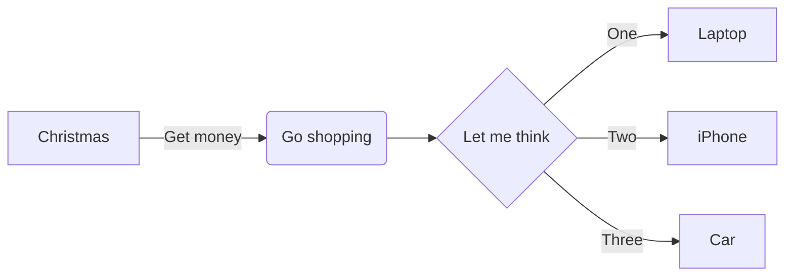
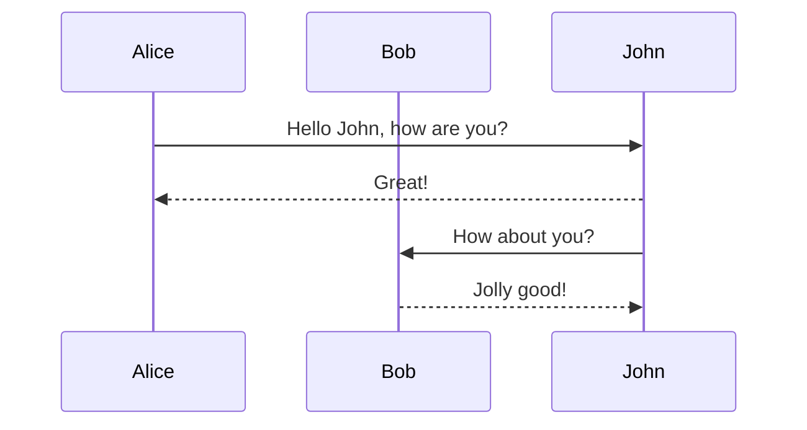
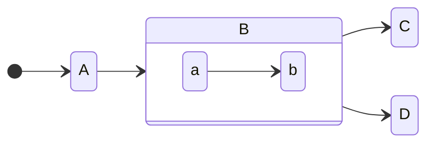
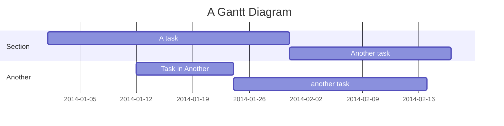

# Slidev Xebia Theme Starter

Presentation slides for developers


---

# What is Slidev?

Slidev is a slides maker and presenter designed for developers.

- 📝 **Text-based** - focus on the content with Markdown, and then style them later
- 🎨 **Themable** - theme can be shared and used with npm packages
- 🧑‍💻 **Developer Friendly** - code highlighting, live coding with autocompletion
- 🤹 **Interactive** - embedding Vue components to enhance your expressions
- 🎥 **Recording** - built-in recording and camera view
- 📤 **Portable** - export into PDF, PNGs, or even a hostable SPA
- 🛠 **Hackable** - anything possible on a webpage

<br>
<br>

Read more about [Why Slidev?](https://sli.dev/guide/why)


---

# Navigation

Hover on the bottom-left corner to see the navigation's controls panel.

| Keyboard Shortcuts | |
| ---------------------------------------------------- | --------------------------- |
| <kbd>space</kbd> / <kbd>tab</kbd> / <kbd>right</kbd> | next animation or slide     |
| <kbd>left</kbd> / <kbd>shift</kbd><kbd>space</kbd>   | previous animation or slide |
| <kbd>up</kbd>                                        | previous slide              |
| <kbd>down</kbd>                                      | next slide                  |

You can also create buttons and hook up navigation in-page: 

<span @click="$slidev.nav.next" class="btn-primary">
Next page <carbon:arrow-right class="inline"/>
</span>


---
layout: two-column
---

# All layouts

A lot of layouts are available out of the box, all styled with the official Xebia presentation theme.

::left::

- cover
- cover-dark
- toc
- toc-two-column
- intro 
- intro-duo
- default
- two-column 
- three-column 
- three-column-dark

::right::

- image-left 
- image-left-dark 
- image-left-variant 
- image-right
- image-right-dark
- image-right-variant
- chapter
- thank-you
- thank-you-dark
- end

::footer::

The following pages contain examples of all layouts.


---
layout: cover
background: /pexels-mizuno-k-12899149.jpg
---

# Layout `cover`

The cover slide. If not overridden, this will be used for the first slide.


---
layout: cover-dark
background: /pexels-junior-teixeira-2047905.jpg
backgroundSize: 150%
---

# Layout `cover-dark`

A variation of the cover. Note that background properties can be manipulated as 
well.


---
layout: toc
background: /pexels-junior-teixeira-2047905.jpg
---

# Layout `toc`

## Subtitle 

Provide a table of contents of your presentation.


---
layout: toc-two-column
---

# Layout `toc-two-column`

::left::

## Left column

Variant of the table of contents with two columns.

::right::

## Right column

Lorem ipsum dolor sit amet, consectetur adipiscing elit.


---
layout: intro
speakerImage: /pexels-emmy-e-2381069.jpg
---

# Layout `intro`

::speaker::

## Janet Doe

### Senior Consultant

- Used for personal introduction. 
- Write some fun content about a speaker and their hobbies.


---
layout: intro-duo
speakerLeftImage: /pexels-emmy-e-2381069.jpg
speakerRightImage: /pexels-andrea-piacquadio-3771807.jpg
---

# Layout `intro-duo`

::speaker-left::

## Janet Doe

### Senior Consultant

Some content.

::speaker-right::

## John Doe

### CTO

- Some other content.
- And another bit


---

# Layout `default`

This is the fallback layout when `layout` is not specified in the frontmatter.

- Use this layout for most of your slides.
- Lists are stylized.
  - You can create long texts in each list item and they will be wrapped. Really long texts such as this one will be wrapped to the next line.
    - You can create nested lists as well.
- You can use **bold** or *italic* text.
- Use `inline code` for code snippets.
- You can also create [links](https://xebia.com).


---
layout: two-column
---

# Layout `two-column`

::left::


## Left column

For two column layouts with an optional header.

::right::


## Right column

1. Lorem ipsum dolor sit amet, consectetur adipiscing elit.
2. Sed do eiusmod tempor:
   - incididunt ut 
   - labore et 
   - dolore magna aliqua.

::footer::

Find Xebia icons [here](https://xebiagroup.sharepoint.com/:f:/r/sites/XebiaCreativeService/Gedeelde%20documenten/Design_Space/Xebia_Brand/Brand%20Assets/Icons)


---
layout: three-column
---

# Layout `three-column`

::one::

| Title
| - 
| Create a table in Xebia style using Markdown table syntax.

::two::

| Add images
| -
| 

::three::

| Colors
| -
| Variation of color per column


---
layout: three-column-dark
---

# Layout `three-column-dark` <br/> with explicit line break in title

For three column layouts with an optional header.

::one::

This is the first column.

::two::

This is the second column.

::three::

Third column.

- You can create lists etc.
- Another item
- Another item


---
layout: image-right
background: /pexels-lex-photography-1109543.jpg
---

# Layout `image-right`

## Subtitle

Slide with image on the right side. Text can be long and is wrapped to the
space available.

<br/>

Find Xebia photos [here](https://xebiagroup.sharepoint.com/:f:/r/sites/XebiaCreativeService/Gedeelde%20documenten/Design_Space/Xebia_Brand/Brand%20Assets/Photo)


---
layout: image-right-dark
background: /pexels-lex-photography-1109543.jpg
---

# Layout `image-right-dark`

## Subtitle

A variation of the image-right layout.


---
layout: image-right-variant
background: /pexels-lex-photography-1109543.jpg
---

# Layout `image-right-variant`

::content::

## Subtitle

A blob variation of the image-left layout. 

Note: requires a `content` section.


---
layout: image-left
background: /pexels-lex-photography-1109543.jpg
---

# Layout `image-left`

## Subtitle

Slide with image on the left side. Text can be long and is wrapped to the
space available.


---
layout: image-left-dark
background: /pexels-lex-photography-1109543.jpg
---

# Layout `image-left-dark`

## Subtitle

A dark variation of the image-left layout.


---
layout: image-left-variant
background: /pexels-lex-photography-1109543.jpg
---

# Layout `image-left-variant`

::content::

## Subtitle

A blob variation of the image-left layout. 

Note: requires a `content` section.


---
layout: chapter
background: /pexels-lex-photography-1109543.jpg
---

Chapter 42

# Layout `chapter`


---
layout: chapter-dark
background: /pexels-lex-photography-1109543.jpg
---

Chapter 21

# Layout `chapter-dark` with a long title


---
layout: thank-you
background: /pexels-lex-photography-1109543.jpg
---

# Layout `thank-you`

Thanks and so long!


---
layout: thank-you-dark
background: /pexels-lex-photography-1109543.jpg
---

# Layout <br/>`thank-you-dark`

Thanks and so long!


---
layout: end
---

# Layout `end`

Used to end the presentation.


---
layout: chapter
background: /pexels-hendrik-b-744321.jpg
backgroundPosition: left
---

# Slidev specific features


---

# Syntax highlighting

Use highlighted code snippets.

```python {1|3-5|6-8}
class Player:

    def __init__(self, name):
        self.name = name
        self.speed = 50

    def increment_speed(self, value):
        self.speed += value
```


---

# TypeScript & Twoslash integration

Enable type information overlay for TypeScript files.

```ts twoslash
interface User {
  id: number;
  firstName: string;
  lastName: string;
  role: string;
}

// ---cut-before---
function updateUser(id: number, update: Partial<User>) {
  const user = getUser(id);
  const newUser = { ...user, ...update };
  saveUser(id, newUser);
}
// ---cut-after---

function getUser(id: number): User {}
function saveUser(id: number, user: User) {}
```

See the [docs](https://twoslash.netlify.app/refs/notations) for notation.


---

# Importing code snippets

Create code snippets from external files, with optional line highlighting and Twoslash integration.

<<< @/snippets/snippet.ts {all|5} twoslash


---
src: /pages/two-slides.md
---


---

# Mermaid graph diagrams

Quickly add diagrams with Mermaid.




---

# Mermaid sequence diagrams




---

# Mermaid state diagrams

Create elaborate state diagrams.




---

# Mermaid Gantt chart



**Note: Styling Gantt charts and others is still work-in-progress. PRs are welcome!**


---

# Embed tweets

<Tweet id="1619536044311089154" :scale="0.5" />


---

# Embed videos

<Youtube id="eW7v-2ZKZOU" :width="880" :height="360" />


---

# Math equations

Inline equations: $\sqrt{a^2+b^2} = c^2$

Block equations:

$$
\begin{equation}
\zeta (2n ) = (-1)^{n+1} \frac{ B_{2n}(2\pi)^{2n} }{ 2(2n)! }
\end{equation}
$$


---
layout: center
class: text-center
---

# Learn more about Slidev

[Documentation](https://sli.dev) / [GitHub repo](https://github.com/slidevjs/slidev)


---
layout: end
---

# End of presentation
